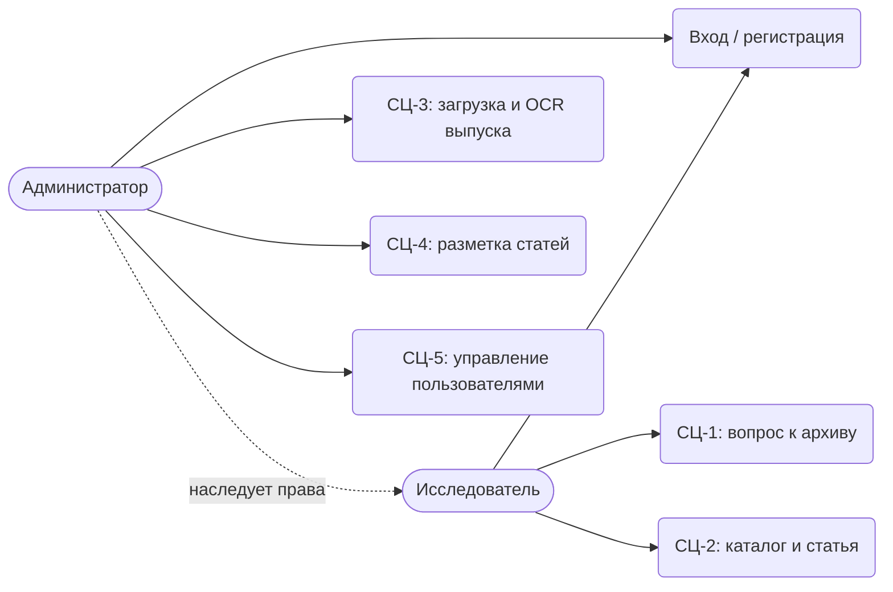
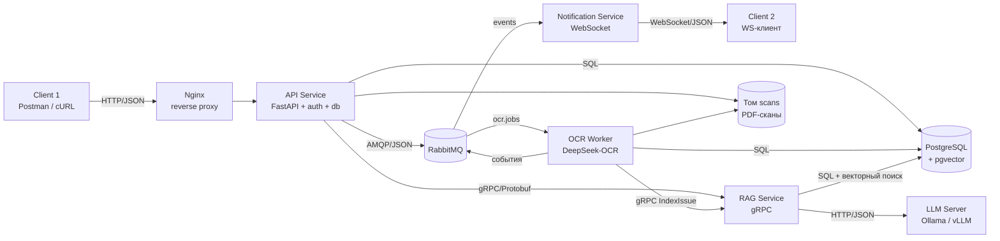
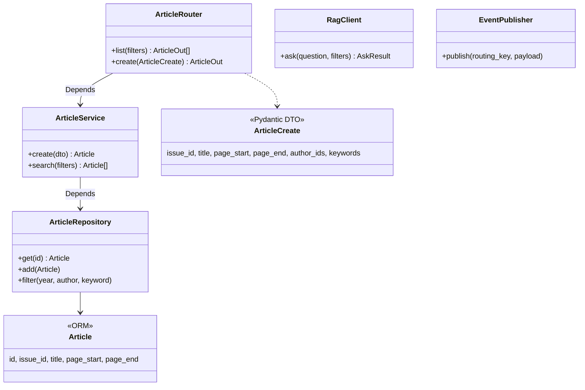
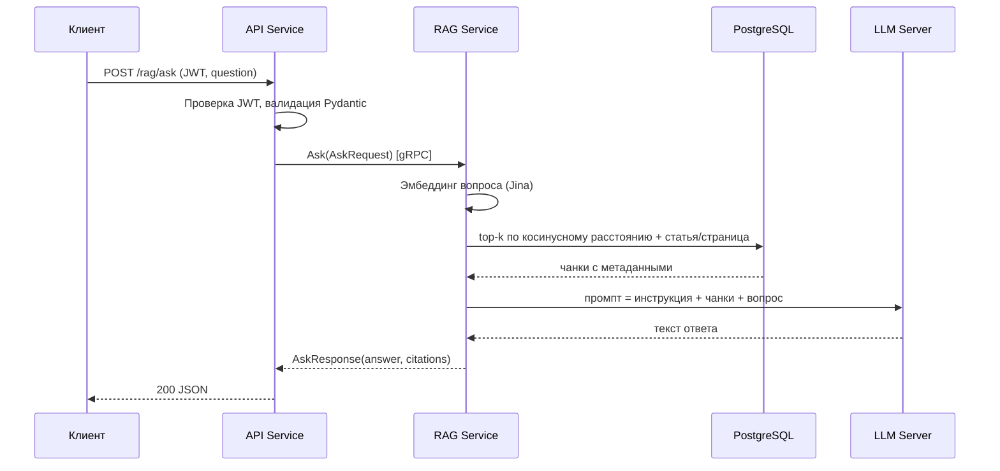
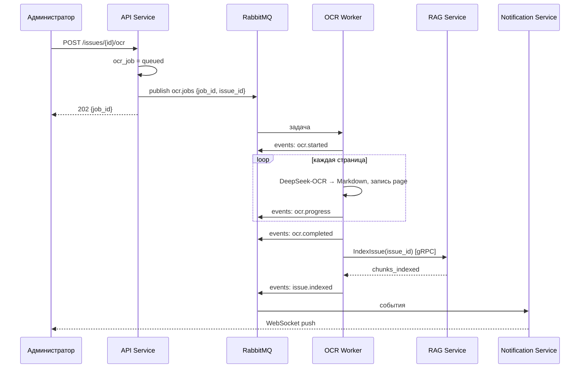
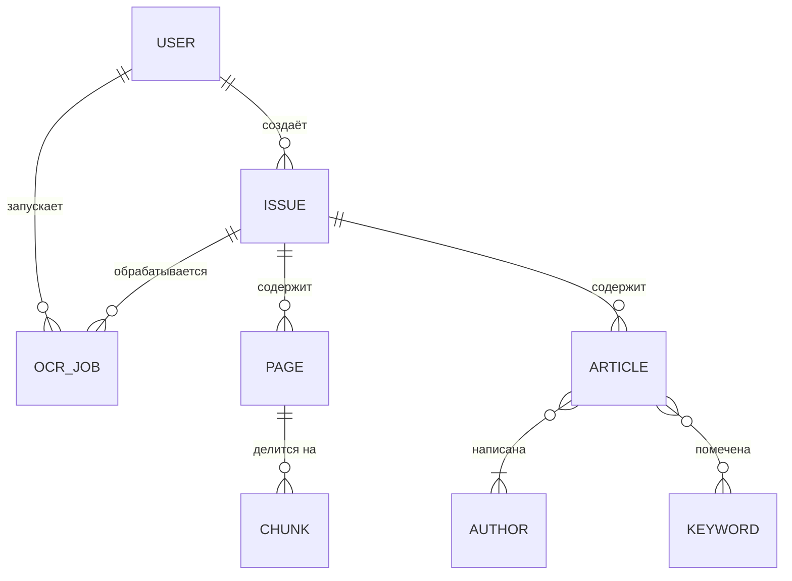

# ЛР0. Техническое задание: RAG-ассистент по архиву журнала «Компьютерная оптика»

Sep 25, 2026

CO-RAG (Computer Optics RAG) — распределённая система, которая переводит сканы архива журнала «Компьютерная оптика» в текст и отвечает на вопросы по архиву со ссылками на статьи и страницы.

**Курс:** Технологии сетевого программирования. **Работа:** ЛР №0 «Выбор и описание предметной области. Проектирование функционала приложения».

**Исполнитель:** Кравченко Иван Антонович, группа 6402. Проект выполняется индивидуально.

**Репозиторий:** ссылка будет добавлена после ЛР №1.

## 1. Введение

Задача системы — сделать архив научного журнала доступным для поиска по смыслу, а не только по заголовкам. Результат — ответ на естественном языке с указанием статьи, выпуска и страницы, на которых он основан.

**Предметная область.** «Компьютерная оптика» — научный журнал Самарского университета по дифракционной оптике, обработке изображений и смежным областям. Часть старых выпусков существует только в виде сканов без текстового слоя. Статьи содержат формулы, таблицы и текст на русском и английском языках.

**Задачи создания ИС:**

1. Оцифровать сканы выпусков: OCR страниц моделью DeepSeek-OCR с выходом в Markdown.
2. Хранить структуру архива: выпуски, страницы, статьи, авторы, ключевые слова.
3. Проиндексировать текст: разбиение на фрагменты (чанки) и эмбеддинги Jina в PostgreSQL + pgvector.
4. Отвечать на вопросы по схеме наивного RAG: эмбеддинг вопроса → top-k ближайших чанков → генерация ответа локальной LLM.
5. Разграничить доступ двух ролей (исследователь, администратор) через JWT.
6. Сообщать о ходе долгой обработки (OCR, индексация) в реальном времени через RabbitMQ и WebSocket.

**Вне рамок проекта:** история диалогов, ручная правка результатов OCR, автоматическая разметка статей в выпуске, улучшенные схемы RAG (реранкинг, гибридный поиск), веб-интерфейс. Клиенты — Postman/cURL для REST и консольный WebSocket-клиент.

## 2. Бизнес-цели и функционал

Главная бизнес-цель — исследователь получает проверяемый ответ по архиву журнала не дольше чем за 30 с. Каждая цель ниже отвечает на вопрос «что?», а столбец «Функции» — на вопрос «как?».

### 2.1. Бизнес-цели

| № | Цель (что?) | Метрика | Целевое значение | Функции (как?) |
| --- | --- | --- | --- | --- |
| Б1 | Сократить время поиска ответа по архиву | Время от вопроса до ответа с источниками (95-й перцентиль) | ≤ 30 с | Ф4, Ф5 |
| Б2 | Перевести сканы архива в машиночитаемый текст | Доля страниц загруженных выпусков, получивших текст OCR | ≥ 95 % | А1, А2, А3 |
| Б3 | Сделать ответы проверяемыми | Доля ответов со ссылкой на статью, выпуск и страницу | 100 % (нет релевантных фрагментов → явный отказ вместо ответа) | Ф4, Ф3 |
| Б4 | Обеспечить качество поиска | Hit@5 на контрольном наборе из 30 вопросов с известной статьёй-источником | ≥ 0,7 | Ф5, А3 |
| Б5 | Сделать обработку архива прозрачной для администратора | Задержка между событием (страница распознана, ошибка, выпуск проиндексирован) и уведомлением | ≤ 5 с, без опроса сервера | А4, Ф6 |

### 2.2. Роли пользователей

- **Исследователь** (`researcher`) — студент, аспирант или сотрудник, который ищет информацию в архиве. Читает каталог и задаёт вопросы. Назначается по умолчанию при регистрации.
- **Администратор** (`admin`) — наполняет архив: загружает сканы, запускает OCR, размечает статьи, управляет пользователями. Имеет все права исследователя. Первый администратор создаётся сид-скриптом.

### 2.3. Функционал

| ID | Функция | Роль | Интерфейс | Операции с БД |
| --- | --- | --- | --- | --- |
| Ф1 | Регистрация и вход, выдача JWT | Все | REST | запись, чтение |
| Ф2 | Каталог выпусков и статей с фильтрами по году, автору, ключевому слову | Исследователь | REST | чтение |
| Ф3 | Карточка статьи: метаданные, авторы, ключевые слова, распознанный текст страниц | Исследователь | REST | чтение |
| Ф4 | Вопрос к архиву (RAG): ответ LLM + список источников | Исследователь | REST → gRPC `Ask` | чтение (векторный поиск) |
| Ф5 | Семантический поиск фрагментов без генерации | Исследователь | REST → gRPC `Search` | чтение |
| Ф6 | Уведомление о появлении нового выпуска в архиве | Исследователь | WebSocket | — |
| А1 | Создание, редактирование, удаление выпуска; загрузка PDF-скана | Администратор | REST | CRUD |
| А2 | Запуск OCR выпуска (асинхронная задача) | Администратор | REST → RabbitMQ | запись |
| А3 | Индексация страниц: чанкинг и эмбеддинги (автоматически после OCR) | Система | gRPC `IndexIssue` | запись |
| А4 | Уведомления о ходе OCR и индексации в реальном времени | Администратор | WebSocket | — |
| А5 | Разметка выпуска: CRUD статей (диапазон страниц), авторов, ключевых слов | Администратор | REST | CRUD |
| А6 | Управление пользователями: список, смена роли, блокировка | Администратор | REST | чтение, редактирование |

## 3. Сценарии использования

Пять сценариев покрывают весь функционал: два у исследователя, три у администратора. Диаграмма прецедентов:



Администратор наследует все прецеденты исследователя.

### СЦ-1. Вопрос к архиву (Исследователь; Ф1, Ф4, Ф5)

1. Отправляет `POST /auth/register` с e-mail, паролем и ФИО; получает роль `researcher`.
2. Отправляет `POST /auth/login`, получает access-токен JWT.
3. Отправляет `POST /rag/ask` с заголовком `Authorization: Bearer <token>` и телом `{"question": "Какие методы расчёта ДОЭ предлагались в 1990-х?", "year_from": 1990, "year_to": 1999}`.
4. Получает JSON: текст ответа и список `citations` (статья, авторы, выпуск, страница, фрагмент, сходство).
5. По ссылке открывает источник: `GET /articles/{id}` и `GET /issues/{id}/pages/{n}`.
6. Альтернатива: `POST /rag/search` возвращает только фрагменты, без генерации.
7. Исключения: нет токена или токен истёк → `401`; сходство всех чанков ниже порога → ответ «в архиве не найдено» без вызова LLM; RAG-сервис недоступен → `503`.

### СЦ-2. Каталог и статья (Исследователь; Ф2, Ф3, Ф6)

1. После входа подключается к `ws://<host>/ws?token=<JWT>`, чтобы получать уведомления о новых выпусках.
2. Запрашивает `GET /issues?year=2005` — список выпусков года.
3. Запрашивает `GET /articles?author=Сойфер&keyword=дифракция` — список статей по фильтрам.
4. Открывает `GET /articles/{id}` — метаданные, авторы в порядке указания, ключевые слова, текст страниц статьи.
5. Когда администратор завершает индексацию выпуска, клиент получает событие `issue.indexed`.

### СЦ-3. Загрузка и OCR выпуска (Администратор; А1–А4)

1. Входит (`POST /auth/login`), подключает WebSocket-клиент к `/ws?token=<JWT>`.
2. Создаёт выпуск: `POST /issues` `{"year": 2005, "volume": 27, "number": 1}` → `201`, статус `created`.
3. Загружает скан: `POST /issues/{id}/scan` (multipart, PDF) → статус `uploaded`, подсчитано число страниц.
4. Запускает распознавание: `POST /issues/{id}/ocr` → `202 Accepted` с `job_id`. API публикует задачу в очередь `ocr.jobs`.
5. По WebSocket получает `ocr.started`, затем `ocr.progress` после каждой страницы (`pages_done / pages_total`).
6. Получает `ocr.completed`, затем `issue.indexed` с числом проиндексированных чанков.
7. Может проверить статус без WebSocket: `GET /ocr-jobs/{job_id}`.
8. Исключения: не PDF или файл > 200 МБ → `422`; повторный запуск при активной задаче → `409`; ошибка OCR → событие `ocr.failed`, статус задачи `failed`; роль `researcher` → `403`.

### СЦ-4. Разметка статей выпуска (Администратор; А5)

1. Просматривает распознанные страницы: `GET /issues/{id}/pages/{n}`.
2. Создаёт или находит авторов: `GET /authors?q=Сойфер`, `POST /authors`.
3. Создаёт статью: `POST /articles` `{"issue_id": 12, "title": "…", "page_start": 5, "page_end": 14, "author_ids": [3, 7], "keywords": ["ДОЭ", "дифракция"]}`.
4. Исправляет ошибку: `PATCH /articles/{id}`; удаляет лишнюю: `DELETE /articles/{id}`.
5. После разметки чанки страниц 5–14 в ответах RAG ссылаются на эту статью.
6. Исключения: диапазон страниц выходит за пределы выпуска → `422`.

### СЦ-5. Управление пользователями (Администратор; А6)

1. Запрашивает `GET /users` — список пользователей.
2. Назначает роль: `PATCH /users/{id}` `{"role": "admin"}` или блокирует: `{"is_active": false}`.
3. Заблокированный пользователь при входе получает `403`.

## 4. Архитектура приложения

Архитектура повторяет схему курса один к одному. gRPC-сервис — это RAG, цепочка RabbitMQ → Socket Service — уведомления об OCR. Добавлены три компонента предметной области: OCR Worker, LLM-сервер и расширение pgvector.

### 4.1. Соответствие схеме курса

| Компонент в курсе | Компонент CO-RAG | Назначение |
| --- | --- | --- |
| Client 1 | REST-клиент (Postman / cURL) | Запросы исследователя и администратора |
| FastAPI Service | API Service | REST API, бизнес-логика, публикация задач и событий |
| Auth Service | Модуль `auth` внутри API Service | Регистрация, хеширование паролей, выдача и проверка JWT |
| DB Service | Модуль `db` (общий пакет ORM-моделей и репозиториев) | Доступ к PostgreSQL через SQLAlchemy |
| DataBase | PostgreSQL 16 + pgvector | Метаданные, текст страниц, векторы чанков |
| gRPC Service | RAG Service | Эмбеддинги Jina, векторный поиск, генерация ответа, индексация |
| RabbitMQ Server | RabbitMQ | Очередь задач OCR и шина событий |
| Socket Service | Notification Service | Потребитель событий, WebSocket-сервер |
| Client 2 | Консольный WebSocket-клиент | Отображение уведомлений |
| — (новый) | OCR Worker | Распознавание сканов DeepSeek-OCR |
| — (новый) | LLM Server (Ollama или vLLM) | Локальная языковая модель с OpenAI-совместимым API |

### 4.2. Диаграмма компонентов



Nginx — дополнительное задание ЛР №2. Он же проксирует `/ws` на Notification Service.

### 4.3. Компоненты

**API Service** (FastAPI, Pydantic, SQLAlchemy 2.0, Uvicorn под Gunicorn). Слои: роутеры → сервисы → репозитории → ORM-модели. Сервисы и репозитории подключаются через `Depends` (Dependency Injection). DTO (Pydantic) и ORM-модели разделены. Содержит gRPC-клиент RAG Service и AMQP-публикатор (aio-pika).

**RAG Service** (grpcio, Protocol Buffers). Методы: `Ask` — ответ с источниками; `Search` — top-k фрагментов; `IndexIssue` — чанкинг и эмбеддинги страниц выпуска. Модель эмбеддингов Jina (рабочий вариант — jina-embeddings-v3, размерность 1024) загружается один раз при старте и обслуживает и вопросы, и индексацию. LLM скрыта за интерфейсом `LLMClient` (OpenAI-совместимый HTTP): модель выбирается переменной окружения `LLM_MODEL`.

**OCR Worker** (aio-pika, PyMuPDF, DeepSeek-OCR). Забирает задачу из `ocr.jobs` (prefetch = 1, ручное подтверждение). Рендерит страницы PDF в изображения (300 dpi), распознаёт в Markdown, пишет страницы в БД, публикует `ocr.progress`. После последней страницы вызывает `IndexIssue`. Требует GPU NVIDIA; может работать на узле кластера университета, подключаясь к тому же брокеру.

**Notification Service** (FastAPI WebSocket, aio-pika). Слушает очередь `notifications`. При подключении проверяет JWT из query-параметра. События `ocr.*` отправляет только администраторам, `issue.indexed` — всем подключённым.

### 4.4. Структура API Service (диаграмма классов)



Остальные сущности (выпуски, авторы, пользователи) устроены так же. `RagClient` и `EventPublisher` внедряются в `RagRouter` и `OcrService`.

### 4.5. Взаимодействие компонентов

| От → К | Протокол | Формат | Режим | Зачем |
| --- | --- | --- | --- | --- |
| Клиент → API Service | HTTP/1.1, REST | JSON | синхронно | Все пользовательские операции |
| API Service → RAG Service | gRPC (HTTP/2) | Protocol Buffers | синхронно | `Ask`, `Search` |
| API Service → RabbitMQ | AMQP 0-9-1 | JSON | асинхронно | Задача в `ocr.jobs` |
| RabbitMQ → OCR Worker | AMQP 0-9-1 | JSON | асинхронно | Получение задачи |
| OCR Worker → RAG Service | gRPC | Protocol Buffers | синхронно | `IndexIssue` |
| OCR Worker → RabbitMQ | AMQP 0-9-1 | JSON | асинхронно | События `ocr.*`, `issue.indexed` |
| RabbitMQ → Notification Service | AMQP 0-9-1 | JSON | асинхронно | Доставка событий |
| Notification Service → клиент | WebSocket | JSON | push | Уведомления в реальном времени |
| RAG Service → LLM Server | HTTP, OpenAI-совместимый API | JSON | синхронно | Генерация ответа |
| API / RAG / OCR → PostgreSQL | TCP, протокол PostgreSQL | SQL | синхронно | Хранение данных |

**Топология RabbitMQ.** Exchange `ocr` (direct) → очередь `ocr.jobs` (durable): команды, каждая обрабатывается одним воркером. Exchange `events` (topic) → очередь `notifications` с привязками `ocr.*` и `issue.*`: события для любых подписчиков.

### 4.6. Последовательность: вопрос к архиву (СЦ-1)



### 4.7. Последовательность: OCR и индексация выпуска (СЦ-3)



### 4.8. Технологии и обоснование

Базовый стек совпадает с курсом: SQLAlchemy, Pydantic, FastAPI, gRPC, RabbitMQ, WebSocket, JWT, JSON + Protocol Buffers, Docker. Ниже — где каждая технология применяется и обоснование добавленных сверх курса.

| Технология | Где | Почему |
| --- | --- | --- |
| PostgreSQL 16 + SQLAlchemy 2.0 + Alembic | Все сервисы с данными | Реляционная структура архива, связи M:N, миграции |
| Pydantic v2 | DTO REST, сообщения RabbitMQ, настройки | Одна схема валидации для HTTP и событий |
| FastAPI | API Service, Notification Service | Асинхронность, DI, OpenAPI-документация, встроенный WebSocket |
| gRPC + Protobuf | RAG Service | Строгий контракт `.proto`, компактная передача списков источников; RAG отделён и масштабируется независимо |
| RabbitMQ | Задачи OCR, события | OCR выпуска длится минуты — HTTP-запрос нельзя держать; задачи не теряются при падении воркера |
| WebSocket | Notification Service | Прогресс OCR без постоянного опроса сервера |
| JWT (HS256) + bcrypt | Модуль `auth`, Notification Service | Без сессий на сервере; токен с ролью проверяется в двух сервисах по общему секрету. Access-токен живёт 30 мин |
| Docker Compose | Развёртывание | Запуск всей системы одной командой |
| **pgvector** (сверх курса) | PostgreSQL | Векторы в той же БД: один SQL-запрос объединяет поиск и фильтры по году; не нужен отдельный контейнер; индекс HNSW |
| **DeepSeek-OCR** (сверх курса) | OCR Worker | Переводит страницу целиком в Markdown с разметкой таблиц и формул, что важно для научных статей; работает локально |
| **Jina Embeddings** (сверх курса) | RAG Service | Многоязычная модель: русские и английские статьи в одном пространстве; длинный контекст; работает локально |
| **Ollama / vLLM** (сверх курса) | LLM Server | OpenAI-совместимый API позволяет менять модель без изменения кода RAG Service; модель выбирается позже |
| **PyMuPDF** (сверх курса) | API Service, OCR Worker | Подсчёт страниц и рендеринг PDF без внешних утилит |

### 4.9. Развёртывание (docker-compose)

| Контейнер | Образ / основа | Порт | Тома |
| --- | --- | --- | --- |
| `postgres` | `pgvector/pgvector:pg16` | 5432 | `pgdata` |
| `rabbitmq` | `rabbitmq:3-management` | 5672, 15672 | — |
| `api` | Python 3.12, Gunicorn + Uvicorn | 8000 | `scans` |
| `rag` | Python 3.12, grpcio | 50051 | `models` |
| `ocr-worker` | Python 3.12 + CUDA, GPU | — | `scans`, `models` |
| `notification` | Python 3.12, Uvicorn | 8001 | — |
| `llm` | `ollama/ollama` или `vllm/vllm-openai` | 11434 / 8002 | `models` |
| `nginx` (опционально) | `nginx:stable` | 80 | — |

Секреты (`JWT_SECRET`, пароли БД и брокера) и настройки (`LLM_MODEL`, `EMBED_MODEL`, `TOP_K`) передаются через `.env`.

## 5. Структура базы данных

БД содержит 8 сущностей и 2 связи «многие-ко-многим»: статья ↔ автор и статья ↔ ключевое слово. СУБД — PostgreSQL 16 с расширением pgvector.

### 5.1. Логическая схема



| Сущность | Что хранит | Связи |
| --- | --- | --- |
| USER | Учётная запись, хеш пароля, роль | 1:N с ISSUE, OCR\_JOB |
| ISSUE | Выпуск журнала: год, том, номер, путь к скану, статус обработки | 1:N с PAGE, ARTICLE, OCR\_JOB |
| PAGE | Страница выпуска и её текст в Markdown после OCR | 1:N с CHUNK |
| ARTICLE | Статья: название, аннотация, DOI, диапазон страниц | M:N с AUTHOR, KEYWORD |
| AUTHOR | Автор: ФИО, организация, ORCID | M:N с ARTICLE |
| KEYWORD | Ключевое слово (уникальное) | M:N с ARTICLE |
| CHUNK | Фрагмент текста страницы и его эмбеддинг | N:1 с PAGE |
| OCR\_JOB | Задача распознавания: статус, прогресс, ошибка | N:1 с ISSUE, USER |

Статья связана со страницами не внешним ключом, а диапазоном `page_start..page_end` внутри выпуска. Поэтому индексация не ждёт разметки статей, а исправление диапазона не требует переиндексации.

### 5.2. Физическая схема (PostgreSQL DDL)

Связи M:N реализованы таблицами-связками `article_authors` и `article_keywords`. Итого 10 таблиц. В проекте схема создаётся миграциями Alembic из ORM-моделей SQLAlchemy.

```sql
CREATE EXTENSION IF NOT EXISTS vector;

CREATE TYPE user_role    AS ENUM ('researcher', 'admin');
CREATE TYPE issue_status AS ENUM ('created', 'uploaded', 'ocr_in_progress', 'ocr_done', 'indexed', 'failed');
CREATE TYPE job_status   AS ENUM ('queued', 'running', 'done', 'failed');

CREATE TABLE users (
    id            BIGSERIAL PRIMARY KEY,
    email         VARCHAR(255) NOT NULL UNIQUE,
    password_hash VARCHAR(255) NOT NULL,          -- bcrypt
    full_name     VARCHAR(255) NOT NULL,
    role          user_role    NOT NULL DEFAULT 'researcher',
    is_active     BOOLEAN      NOT NULL DEFAULT TRUE,
    created_at    TIMESTAMPTZ  NOT NULL DEFAULT now()
);

CREATE TABLE issues (
    id          BIGSERIAL PRIMARY KEY,
    year        SMALLINT     NOT NULL CHECK (year >= 1987),
    volume      SMALLINT,                          -- у ранних выпусков может отсутствовать
    number      SMALLINT     NOT NULL,
    scan_path   TEXT,                              -- путь в томе scans
    page_count  INT          CHECK (page_count > 0),
    status      issue_status NOT NULL DEFAULT 'created',
    created_by  BIGINT       NOT NULL REFERENCES users(id),
    created_at  TIMESTAMPTZ  NOT NULL DEFAULT now(),
    UNIQUE (year, number)
);

CREATE TABLE pages (
    id            BIGSERIAL PRIMARY KEY,
    issue_id      BIGINT NOT NULL REFERENCES issues(id) ON DELETE CASCADE,
    page_number   INT    NOT NULL CHECK (page_number > 0),
    text_md       TEXT,                            -- результат DeepSeek-OCR
    ocr_model     VARCHAR(100),
    recognized_at TIMESTAMPTZ,
    UNIQUE (issue_id, page_number)
);

CREATE TABLE articles (
    id          BIGSERIAL PRIMARY KEY,
    issue_id    BIGINT  NOT NULL REFERENCES issues(id) ON DELETE CASCADE,
    title       TEXT    NOT NULL,
    abstract    TEXT,
    doi         VARCHAR(100) UNIQUE,
    language    CHAR(2) NOT NULL DEFAULT 'ru',
    page_start  INT     NOT NULL,
    page_end    INT     NOT NULL,
    created_at  TIMESTAMPTZ NOT NULL DEFAULT now(),
    CHECK (page_start <= page_end)
);
CREATE INDEX ix_articles_issue_pages ON articles (issue_id, page_start, page_end);

CREATE TABLE authors (
    id          BIGSERIAL PRIMARY KEY,
    full_name   VARCHAR(255) NOT NULL,
    affiliation VARCHAR(500),
    orcid       CHAR(19) UNIQUE
);
CREATE INDEX ix_authors_full_name ON authors (full_name);

CREATE TABLE article_authors (                     -- M:N статья ↔ автор
    article_id   BIGINT   NOT NULL REFERENCES articles(id) ON DELETE CASCADE,
    author_id    BIGINT   NOT NULL REFERENCES authors(id)  ON DELETE RESTRICT,
    author_order SMALLINT NOT NULL CHECK (author_order > 0),
    PRIMARY KEY (article_id, author_id)
);

CREATE TABLE keywords (
    id    BIGSERIAL PRIMARY KEY,
    value VARCHAR(100) NOT NULL UNIQUE
);

CREATE TABLE article_keywords (                    -- M:N статья ↔ ключевое слово
    article_id BIGINT NOT NULL REFERENCES articles(id) ON DELETE CASCADE,
    keyword_id BIGINT NOT NULL REFERENCES keywords(id) ON DELETE CASCADE,
    PRIMARY KEY (article_id, keyword_id)
);

CREATE TABLE chunks (
    id          BIGSERIAL PRIMARY KEY,
    page_id     BIGINT   NOT NULL REFERENCES pages(id) ON DELETE CASCADE,
    chunk_index SMALLINT NOT NULL,
    text        TEXT     NOT NULL,
    token_count INT,
    embedding   VECTOR(1024) NOT NULL,             -- размерность зависит от модели Jina
    UNIQUE (page_id, chunk_index)
);
CREATE INDEX ix_chunks_embedding ON chunks USING hnsw (embedding vector_cosine_ops);

CREATE TABLE ocr_jobs (
    id           BIGSERIAL PRIMARY KEY,
    issue_id     BIGINT     NOT NULL REFERENCES issues(id) ON DELETE CASCADE,
    requested_by BIGINT     NOT NULL REFERENCES users(id),
    status       job_status NOT NULL DEFAULT 'queued',
    pages_total  INT,
    pages_done   INT        NOT NULL DEFAULT 0,
    error        TEXT,
    created_at   TIMESTAMPTZ NOT NULL DEFAULT now(),
    started_at   TIMESTAMPTZ,
    finished_at  TIMESTAMPTZ
);
-- не более одной активной задачи на выпуск (иначе API отвечает 409)
CREATE UNIQUE INDEX ux_ocr_jobs_active ON ocr_jobs (issue_id) WHERE status IN ('queued', 'running');
```

### 5.3. Ключевой запрос RAG: поиск фрагментов с источниками

```sql
SELECT c.id, c.text, p.page_number, i.year, i.number,
       a.id AS article_id, a.title,
       1 - (c.embedding <=> :query_vec) AS score
FROM chunks c
JOIN pages  p ON p.id = c.page_id
JOIN issues i ON i.id = p.issue_id
LEFT JOIN articles a ON a.issue_id = p.issue_id
                    AND p.page_number BETWEEN a.page_start AND a.page_end
WHERE i.year BETWEEN :year_from AND :year_to
ORDER BY c.embedding <=> :query_vec
LIMIT :top_k;
```

Оператор `<=>` — косинусное расстояние pgvector. Запрос выполняет RAG Service; в коде он записывается средствами SQLAlchemy (`Vector.cosine_distance`).

## 6. Соответствие требованиям и план работ

Проект выполняет все три формальных требования ЛР №0 и задействует все 9 технологий курса.

| Требование | Как выполняется |
| --- | --- |
| Чтение, запись и редактирование данных в БД | CRUD выпусков, статей, авторов, ключевых слов (А1, А5); редактирование пользователей (А6); запись страниц, чанков и задач OCR (А2, А3) |
| Хотя бы две роли пользователей | `researcher` и `admin`; проверка роли из JWT в зависимости FastAPI |
| Хотя бы три сущности и одна связь M:N | 8 сущностей; M:N статья ↔ автор и статья ↔ ключевое слово |

### План по лабораторным работам

| ЛР | Что реализуется в CO-RAG | Демонстрация |
| --- | --- | --- |
| №1 | PostgreSQL + pgvector, ORM-модели всех таблиц, репозитории с CRUD, сид-данные (2–3 выпуска, статьи, авторы); доп.: миграции Alembic | Тестовый скрипт с выводом в консоль |
| №2 | API Service: `/auth`, `/users`, `/issues`, `/articles`, `/authors`, `/keywords`, `/ocr-jobs`; DTO отдельно от ORM; доп.: Nginx и JWT | Postman / cURL |
| №3 | RAG Service с `rag.proto`: `Ask`, `Search`, `IndexIssue`; эндпоинты `/rag/ask`, `/rag/search` | Логи API и RAG в двух процессах |
| №4 | Очередь `ocr.jobs`, OCR Worker, события `ocr.*` / `issue.indexed`, Notification Service, консольный WS-клиент | API, Notification Service и клиент — отдельные процессы |
| №5 | Dockerfile на каждый сервис, `docker-compose.yml`, тома `pgdata` / `scans` / `models`, `.env` | `docker compose up` |

До готовности OCR Worker (ЛР №4) текст страниц для ЛР №3 загружается сид-скриптом.

## Приложения

**Репозиторий:** ссылка на GitHub будет добавлена после ЛР №1.

### Приложение А. Черновик контракта `rag.proto`

```protobuf
syntax = "proto3";
package corag.rag.v1;

service RagService {
  rpc Ask (AskRequest) returns (AskResponse);
  rpc Search (SearchRequest) returns (SearchResponse);
  rpc IndexIssue (IndexIssueRequest) returns (IndexIssueResponse);
}

message Filters {
  optional int32 year_from = 1;
  optional int32 year_to = 2;
}

message AskRequest {
  string question = 1;
  int32 top_k = 2;          // по умолчанию 5
  Filters filters = 3;
}

message Citation {
  int64 chunk_id = 1;
  optional int64 article_id = 2;   // пусто, если страница ещё не размечена
  string article_title = 3;
  int32 year = 4;
  int32 issue_number = 5;
  int32 page_number = 6;
  string snippet = 7;
  float score = 8;
}

message AskResponse {
  string answer = 1;
  repeated Citation citations = 2;
  bool found = 3;          // false — релевантных фрагментов нет, LLM не вызывалась
}

message SearchRequest {
  string query = 1;
  int32 top_k = 2;
  Filters filters = 3;
}

message SearchResponse {
  repeated Citation results = 1;
}

message IndexIssueRequest {
  int64 issue_id = 1;
}

message IndexIssueResponse {
  int32 pages_indexed = 1;
  int32 chunks_indexed = 2;
}
```

### Приложение Б. Формат сообщений RabbitMQ и WebSocket (JSON)

Задача в очереди `ocr.jobs`:

```json
{"job_id": 41, "issue_id": 12, "scan_path": "scans/2005-1.pdf", "requested_by": 1}
```

Событие в exchange `events` (ключ маршрутизации `ocr.progress`). Notification Service пересылает его клиенту без изменений:

```json
{
  "event": "ocr.progress",
  "occurred_at": "2026-10-12T14:03:21Z",
  "audience": "admin",
  "data": {"job_id": 41, "issue_id": 12, "pages_done": 17, "pages_total": 96}
}
```

| Событие | Кто публикует | Получатели | Поля `data` |
| --- | --- | --- | --- |
| `ocr.started` | OCR Worker | администраторы | `job_id`, `issue_id`, `pages_total` |
| `ocr.progress` | OCR Worker | администраторы | `job_id`, `pages_done`, `pages_total` |
| `ocr.completed` | OCR Worker | администраторы | `job_id`, `issue_id`, `duration_s` |
| `ocr.failed` | OCR Worker | администраторы | `job_id`, `page_number`, `error` |
| `issue.indexed` | OCR Worker | все подключённые | `issue_id`, `year`, `number`, `chunks_indexed` |

Схемы сообщений описаны моделями Pydantic в общем пакете `contracts` и проверяются при публикации и при получении.
